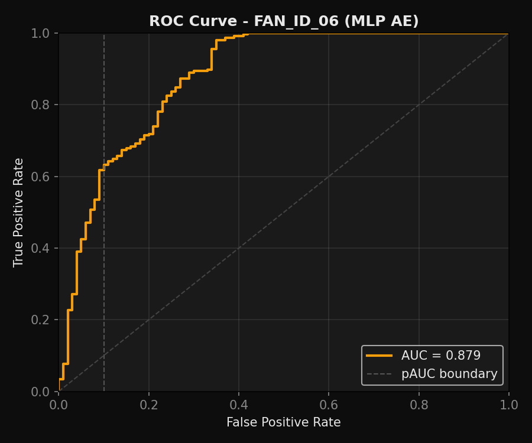
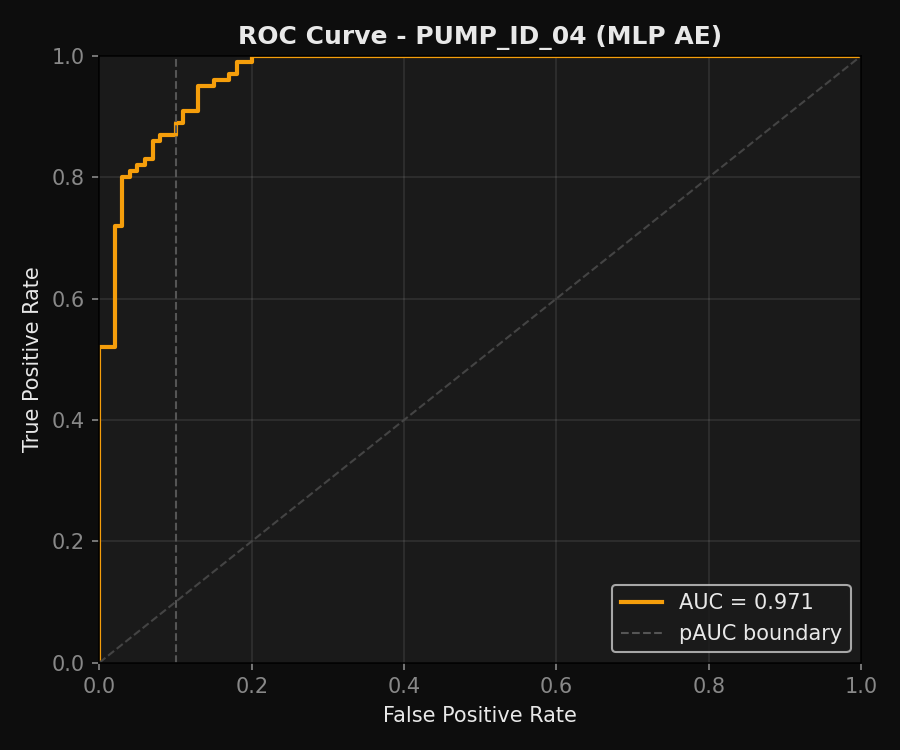
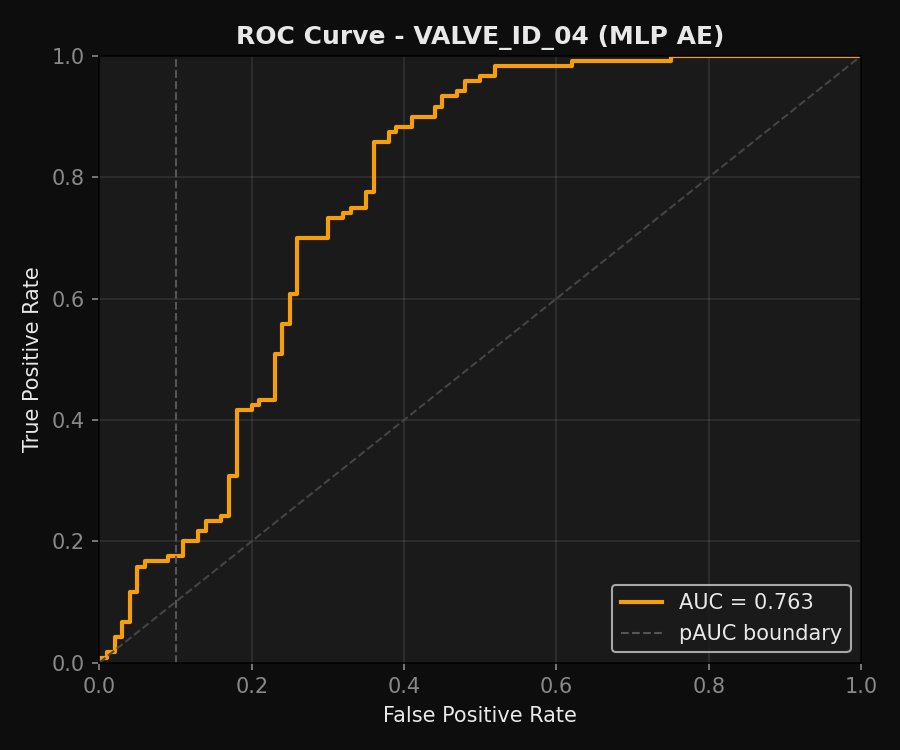

# Auralytics

Acoustic anomaly detection for industrial machine monitoring. Auralytics trains unsupervised autoencoders on normal machine audio, then flags clips whose reconstruction error looks abnormal. The final project includes a working web demo: choose a machine, upload a `.wav`, and get a normal/anomalous verdict with spectrogram and reconstruction-error visuals.

## Final Result

The final system uses per-machine-ID frame-level MLP autoencoders. This was the turning point: the early whole-spectrogram convolutional autoencoder reconstructed normal and anomalous clips too similarly, while the per-ID MLP learned tighter normal operating patterns.

| Demo machine | Selected ID | AUC | pAUC | F1 | Threshold |
|---|---:|---:|---:|---:|---:|
| Fan | id_06 | 0.879 | 0.419 | 0.945 | 0.44144 |
| Pump | id_04 | 0.971 | 0.851 | 0.913 | 0.67290 |
| Valve | id_04 | 0.763 | 0.126 | 0.814 | 0.32718 |

Overall mean AUC across all evaluated IDs is about 0.726. Full per-ID tables and plots are in [docs/final_results.md](docs/final_results.md) and [results/per_id_v2](results/per_id_v2/).

## Result Visuals

| Fan id_06 | Pump id_04 | Valve id_04 |
|---|---|---|
|  |  |  |
|  |  |  |

## How It Works

```text
raw wav audio
  -> log-mel spectrogram, 128 mel bins, 16 kHz, no per-clip standardization
  -> sliding 5-frame windows, flattened to 640 features
  -> global training-window normalization per machine ID
  -> MLP autoencoder reconstruction
  -> mean window MSE as anomaly score
  -> threshold comparison for NORMAL / ANOMALOUS verdict
```

The preprocessing detail matters. We preserve absolute log-mel scale with `librosa.power_to_db(..., ref=1.0)`. Per-clip normalization was intentionally removed because it made normal and anomalous clips statistically too similar.

## Web Demo

Backend:

```bash
cd backend
py -3 -m pip install -r requirements.txt
py -3 -m uvicorn main:app --reload --host 0.0.0.0 --port 8000
```

Frontend:

```bash
cd frontend
py -3 -m http.server 5500
```

Open `http://localhost:5500`, select a machine, upload a DCASE `.wav`, and run detection.

Backend endpoints:

| Endpoint | Purpose |
|---|---|
| `GET /health` | Confirms API is alive and models are loaded |
| `GET /machines` | Returns available demo machines, AUCs, and thresholds |
| `POST /predict` | Accepts `file` + `machine`, returns score, verdict, spectrogram, and error map |

## Training and Evaluation

Preprocess raw DCASE audio:

```bash
python -m src.preprocess --machine_types fan pump valve --data_dir data/raw --out_dir data/processed_v2
```

Train one per-ID model:

```bash
python -m src.train --machine_type fan --machine_id id_06 --epochs 120 --batch_size 512 --processed_dir data/processed_v2 --models_dir models_per_id_v2 --results_dir results/per_id_v2
```

Evaluate all IDs for one machine:

```bash
python -m src.evaluate --machine_type fan --all_ids --processed_dir data/processed_v2 --models_dir models_per_id_v2 --results_dir results/per_id_v2 --save_csv results/per_id_v2/fan_all_ids_summary.csv
```

## Project Structure

```text
backend/              FastAPI demo backend
backend/models/       Selected demo checkpoints and normalizers
frontend/             Static web UI for the live demo
src/                  Preprocessing, datasets, model, train, evaluate code
notebooks/            EDA/training/evaluation notebooks
data/                 Raw and processed datasets, gitignored
results/per_id_v2/    Final CSV summaries and result plots
docs/                 Report-ready notes and final result summary
```

## Dataset

Dataset: DCASE 2020 Task 2, unsupervised detection of anomalous sounds for machine condition monitoring.

Raw and processed audio are not committed to git. See [data/README.md](data/README.md) for the expected layout.

## Tech Stack

PyTorch, librosa, scikit-learn, FastAPI, Matplotlib, vanilla HTML/CSS/JavaScript.

CPEN 355 Final Project.
