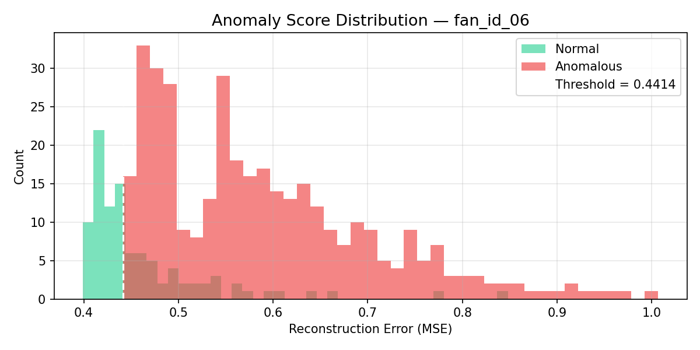
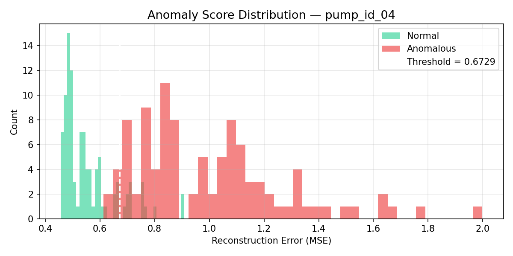
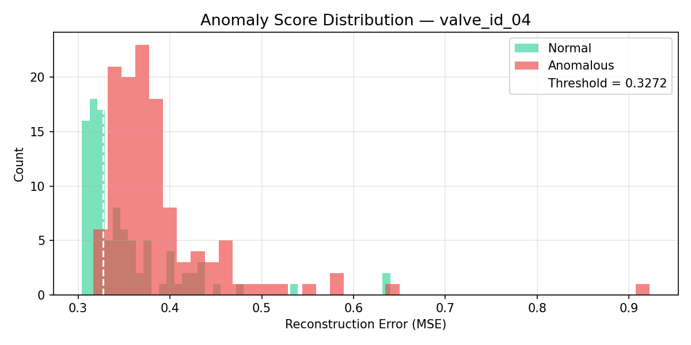

# Final Results

This page summarizes the final v2 per-machine-ID MLP autoencoder results.

## Why per-ID models

The DCASE machine IDs behave like different operating domains. Training one model across all IDs diluted those domain-specific normal patterns. Training one MLP autoencoder per machine ID produced stronger separation and gave the demo a clean selector-based design.

## Selected Demo Models

| Machine | ID | AUC | pAUC | F1 | Threshold | Why selected |
|---|---:|---:|---:|---:|---:|---|
| Fan | id_06 | 0.879 | 0.419 | 0.945 | 0.44144 | Best fan ID and visually strong separation |
| Pump | id_04 | 0.971 | 0.851 | 0.913 | 0.67290 | Best overall demo model |
| Valve | id_04 | 0.763 | 0.126 | 0.814 | 0.32718 | Best valve ID |

## Fan

| ID | AUC | pAUC | F1 | Threshold |
|---:|---:|---:|---:|---:|
| id_00 | 0.546 | 0.054 | 0.891 | 0.34771 |
| id_02 | 0.818 | 0.295 | 0.925 | 0.50891 |
| id_04 | 0.629 | 0.122 | 0.881 | 0.42701 |
| id_06 | 0.879 | 0.419 | 0.945 | 0.44144 |

Mean AUC: 0.718.

## Pump

| ID | AUC | pAUC | F1 | Threshold |
|---:|---:|---:|---:|---:|
| id_00 | 0.687 | 0.178 | 0.745 | 0.52574 |
| id_02 | 0.631 | 0.312 | 0.689 | 0.40438 |
| id_04 | 0.971 | 0.851 | 0.913 | 0.67290 |
| id_06 | 0.776 | 0.314 | 0.734 | 0.39324 |

Mean AUC: 0.766.

## Valve

| ID | AUC | pAUC | F1 | Threshold |
|---:|---:|---:|---:|---:|
| id_00 | 0.694 | 0.103 | 0.787 | 0.32086 |
| id_02 | 0.707 | 0.104 | 0.797 | 0.32401 |
| id_04 | 0.763 | 0.126 | 0.814 | 0.32718 |
| id_06 | 0.613 | 0.042 | 0.746 | 0.31598 |

Mean AUC: 0.694.

## Report narrative

The project has a strong experimental arc:

1. Whole-spectrogram convolutional autoencoder: learned broad spectrogram structure and generalized too well, producing near-random AUC around 0.5.
2. Frame-level MLP autoencoder pooled across IDs: improved training behavior but still mixed different operating domains.
3. Per-ID frame-level MLP with raw log-mel dB features: preserved amplitude information, learned tighter normal patterns, and produced the final demo-ready results.

The final system is therefore not just a better score; it is an explained design evolution backed by experiments.
